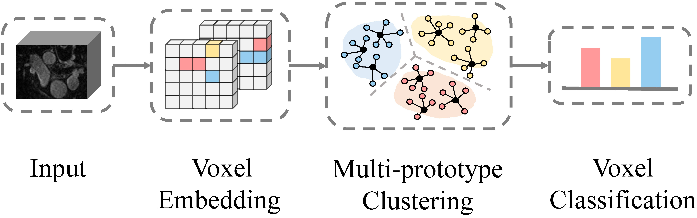
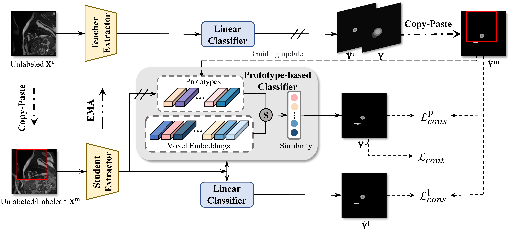
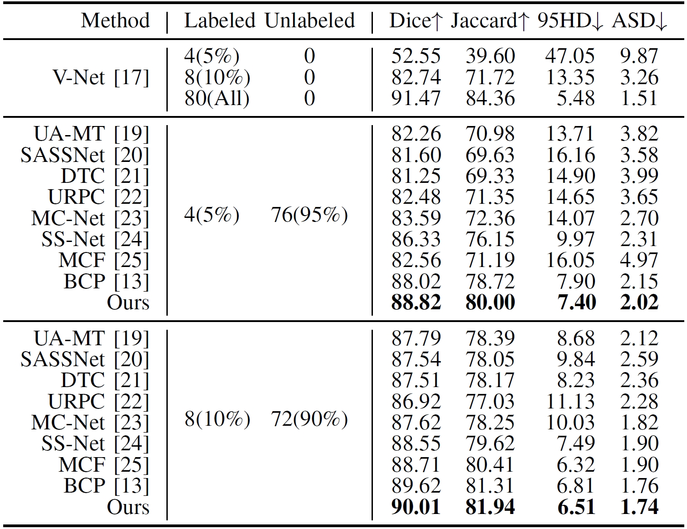
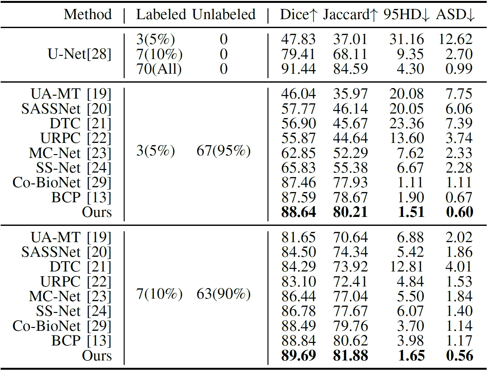
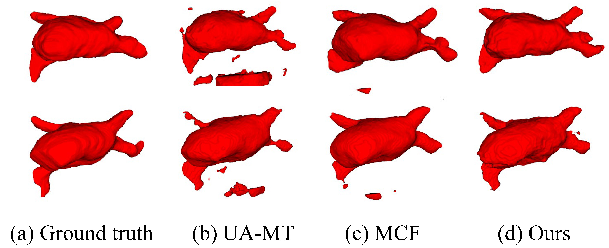
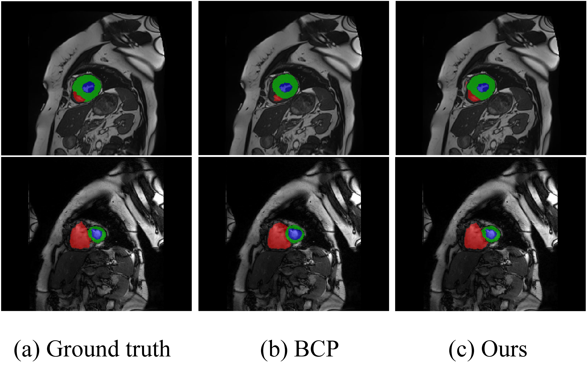

## Multi-Prototype-based Embedding Refinement for Medical Image Segmentation

<p align="center">
    <a href="https://scholar.google.com/citations?user=8V6O60gAAAAJ&hl=en"><strong>Yali Bi <sup>1</sup></strong></a>
    .
    <a href=""><strong>Enyu Che <sup>1</sup></strong></a>
    .
    <a href="https://scholar.google.com.hk/citations?user=-WKfgd0AAAAJ&hl=zh-CN"><strong>Yinan Chen <sup>1</sup></strong></a>
    .
    <br><a href="https://scholar.google.com/citations?user=HaefBCQAAAAJ&hl=en&authuser=1"><strong>Yuanpeng He <sup>2</sup></strong></a>
    .
    <a href="https://jingweiqu.github.io/"><strong>Jingwei Qu <sup>1*</sup></strong></a>
<p align="center">
    <strong><sup>1</sup>Southwest University </strong> &nbsp;&nbsp;&nbsp; 
    <strong><sup>2</sup>Peking University</strong> &nbsp;&nbsp;&nbsp; 


<p align="center">
    <a href='./Assets/ICASSP-2025.pdf'>
      
         </a>  

This is the official repository for "Multi-Prototype-based Embedding Refinement for Medical Image Segmentation" 2025ICASSP🚀 

---

## Abstract

Medical image segmentation aims to identify anatomical structures at the voxel level. Segmentation accuracy relies on distinguishing voxel differences. Compared to advancements achieved in studies of the inter-class variance, the intra-class variance receives less attention. Moreover, traditional linear classifiers, limited by a single learnable weight per class, struggle to capture this finer distinction.  To address the above challenges, we propose a Multi-Prototype-based Embedding Refinement method for semi-supervised medical image segmentation. Specifically, we design a multi-prototype-based classification strategy, rethinking the segmentation from the perspective of structural relationships between voxel embeddings. The intra-class variations are explored by clustering voxels along the distribution of multiple prototypes in each class.  

Next, we introduce a consistency constraint to alleviate the limitation of linear classifiers. This constraint integrates different classification granularities from a linear classifier and the proposed prototype-based classifier. In the thorough evaluation on two popular benchmarks, our method achieves superior performance compared with state-of-the-art methods.

---

## Multi-Prototype-based Classification



---

## Architecture of MPER



---

## Quantitative Results

### LA Dataset Results

  
Comparison of segmentation quality on the LA dataset. "Labeled" and "Unlabeled" indicate the number and proportion of labeled and unlabeled samples, respectively. Values of four metrics, Dice coefficient, Jaccard index, 95HD, and ASD, are reported. Numbers in bold indicate the best performance.

### ACDC Dataset Results

  
Comparison of segmentation quality on the ACDC dataset.

---

## Qualitative Results

### 3D Segmentation Visualization

  
3D segmentation visualization on the LA dataset.

### 2D Segmentation Visualization

  
2D segmentation visualization on the ACDC dataset.

---

## Installation

##### Dataset:

Data could be got at [LA](https://github.com/yulequan/UA-MT/tree/master/data) and [ACDC](https://github.com/HiLab-git/SSL4MIS/tree/master/data/ACDC).

##### Environment Setup:

```
conda env create -f environment.yml
conda activate MPER
```

##### To train a model:

```
python ./code/LA_train.py  #for LA training
python ./code/ACDC_train.py  #for ACDC training
```

##### To test a model:

```
python ./code/test_LA.py  #for LA testing
python ./code/test_ACDC.py  #for ACDC testing
```

## Citation

If you find these projects useful, please consider citing:

```bibtex
@inproceedings{bi2025multi,
    title={Multi-Prototype-based Embedding Refinement for Medical Image Segmentation},
    author={Bi, Yali and Che, Enyu and Chen, Yinan and He, Yuanpeng and Qu, Jingwei},
    booktitle={Proceedings of the IEEE International Conference on Acoustics, Speech and Signal Processing},
    year={2025},
    publisher={IEEE},
    address={New York}
}
```

## Acknowledgements
Our code is largely based on [BCP](https://github.com/DeepMed-Lab-ECNU/BCP). Thanks for these authors for their valuable work, hope our work can also contribute to related research.


